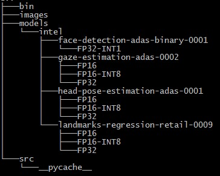
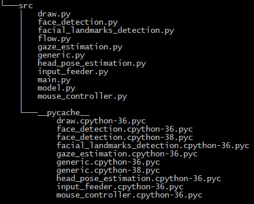
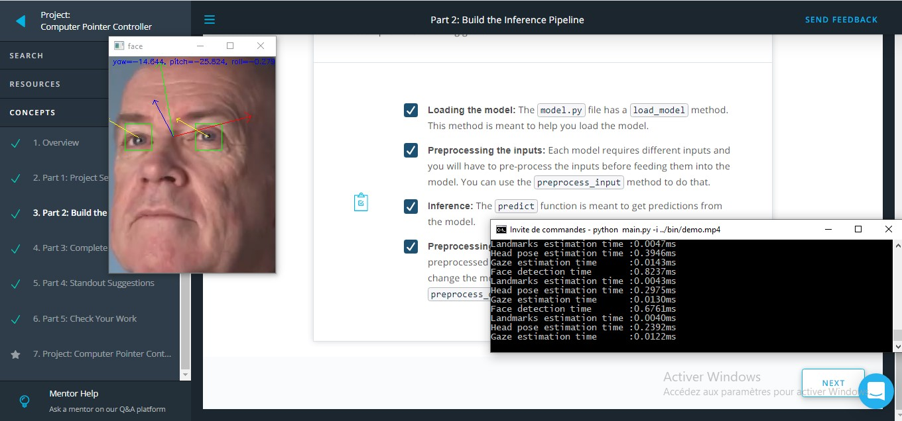
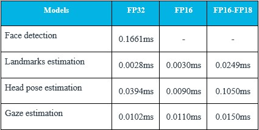
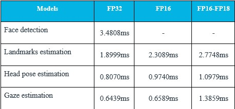

# Computer Pointer Controller

Computer Pointer Controller is a smart edge application that use a gaze of a person to move computer mouse. It was implemented using four DL Pretrained Models: face detection model, landmarks estimation, head pose estimation and finally the gaze estimation model

## Project Set Up and Installation
The application is developped and tested using Openvino 2020.4. Refer to the [official documentataion](https://docs.openvinotoolkit.org/latest/index.html).

### Download the Models

```
source path-to-openvino/bin/setupvars.sh

> cd path-to-openvino/deployment_tools/tools/model_downloader/

>  pip3 install -r requirements.in

>  python3 downloader.py --name face-detection-adas-binary-0001 -o path-to-project-folder/models

>  python3 downloader.py --name landmarks-regression-retail-0009 -o path-to-project-folder/models

>  python3 downloader.py --name head-pose-estimation-adas-0001 -o path-to-project-folder/models

>  python3 downloader.py --name gaze-estimation-adas-0002 -o path-to-project-folder/models
```

### Install dependencies 
```
> cd path-to-project-folder

> python3 -m venv /path/

> source /path/environment/bin/activate

> pip3 install -r requirements.txt
```
### Project structure



    - The bin directory contains a test video

    - The Project files ara located on the src directory



    - The project use defauld models located on the models directory
    

## Demo
Use the test video input in the bin folder to test the Application.
```
> cd path-to-project-folder
> python3 src/main.py -i bin/demo.mp4

```



## Documentation
The Application coordinate the flow of data from the input, and then amongst the different models and finally to the mouse controller. The flow of data will look like this:


### Arguments
The application take a list of arguments:
    -i : the path of the input file. Video, Image, by default the webcam will be used
    -pt : Probability threshold for detections filtering. the default value is 0.4
    -m_df : Face detection model name path
    -m_ld : Landmarks detection model name path
    -m_hpe : Head pose estimation model name path
    -m_ge : Gaze estimation model name path
    -d_df : Face detection device
    -d_ld : Landmarks detection device
    -d_hpe : Head pose estimation device
    -d_ge : Gaze estimation device
Use the ```--help``` to show all options

### Model documentations
* [Face Detection Model](https://docs.openvinotoolkit.org/latest/omz_models_intel_face_detection_adas_binary_0001_description_face_detection_adas_binary_0001.html)

* [Head Pose Estimation Model](https://docs.openvinotoolkit.org/latest/omz_models_intel_head_pose_estimation_adas_0001_description_head_pose_estimation_adas_0001.html)

* [Landmarks Estimation Model](https://docs.openvinotoolkit.org/latest/omz_models_intel_landmarks_regression_retail_0009_description_landmarks_regression_retail_0009.html)

* [Gaze Estimation Model](https://docs.openvinotoolkit.org/latest/omz_models_intel_gaze_estimation_adas_0002_description_gaze_estimation_adas_0002.html)


## Benchmarks
### Average inference time usin the CPU

### Loading time for each model depending on the precision of the model using the CPU:

## Results

Low precision models take less time for inference and more time to load.


### Edge Cases
The application handle input video with more than one person and uses the gaze of the first detected person to mouve the mouse. 
The Application does not safe failing, if some detections are missed in frames, this will cause an issue. PyAutoGUI fail-safe triggered from mouse moving to a corner of the screen.
